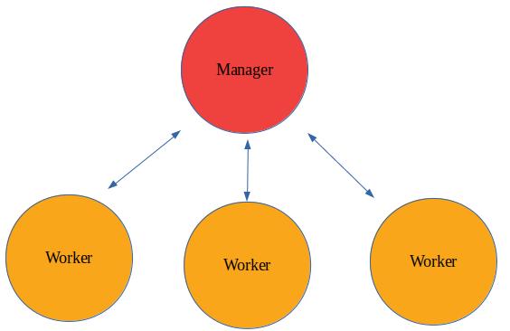
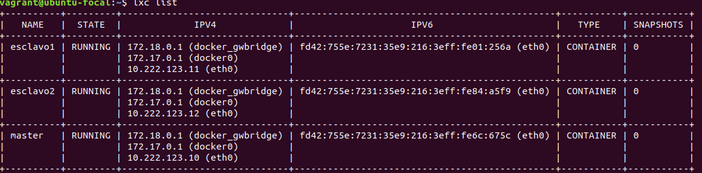
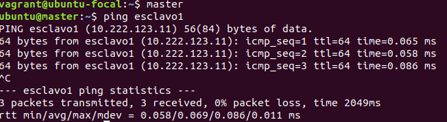

# Table of Contents

* [ROS Noetic Docker 1](#ROS-Noetic-Docker-1)
* [Docker Swarm](#Docker-Swarm)
  * [What is a docker Swarm?](#What-is-a-docker-Swarm)
  * [How Docker Swarm Works?](#How-Docker-Swarm-Works)
  * [How Run this Didactic Project?](#How-Run-this-Didactic-Project)
    * [Dependencies](#Dependencies)
    * [Let's Start!](#Lets-Start)
      * [Starting the Environment](#Starting-the-Environment)
      * [Cluster Startup](#Cluster-Startup)

# ROS Noetic Docker 1

That is a simple Docker that install the *ros-noetic-ros-base* environment and launches a *roscore* for demostrating that it works

# Docker Swarm

With this example, I pretend to simulate the performance of a cluster formed by different nodes. Before to start, I am going to explain... **what is a docker swarm?**

## What is a docker Swarm?

You can find more info [here](https://docs.docker.com/engine/swarm/key-concepts/) but, briefly, Docker Swarm is a *docker based* technology that allow us to run a docker container in a distributed system formed by N nodes connected to each other. In this way, *Docker Swarm* provides a load balancing for the optimal deployment of the different tasks between all nodes.

## How Docker Swarm Works?
*Docker Swarm* follows a **master-slave** architecture. So, if we have 4 nodes, one of then will be the *master* and the others will be the *slaves*. In the Docker terminology, *master* is named **manager** and *slave* is named **worker**.

In this way, we would have something like this:



<hr />

First, I will tell how this project works and how reproduce its result.

## How Run this Didactic Project?

### Dependencies

* **Virtual Box:** You need the 5.2 version or older of Virtual Box. You can install it from [here](https://www.virtualbox.org/wiki/Download_Old_Builds_5_2)

* **Vagrant:** It is a virtual machines manager. You can install it with ``sudo apt install vagrant``.

> NOTE: If you don't have activated the virtualization in BIOS, that is the moment. Otherwise, you won't can start the virtual machine.

### Let's Start!

#### Starting the Environment

* You need to download from *Releases* the following files: **docker_swarm.box.aa, docker_swarm.box.ab** and **docker_swarm.box.ac**. These files are only one file that was splitted because it was very heavy.

* We are going to get the *.box* file from the three files with the next command:

  ```
  $ cat docker_swarm.box.a* > docker_swarm.box
  ```

Now, we have the packaged virtual machine. We need to import it.

* Import the *docker_swarm.box* file with the next command:

  ```
  $ vagrant box add docker_swarm docker_swarm.box
  ```

With this command, we will have imported an image named *docker_swarm*.

* The next step is to create the virtual box from this image previously imported. For doing this, we need type the next commands:

  ```
  $ mkdir docker_swarm && cd docker_swarm
  $ vagrant init docker_swarm
  ```
  > NOTE: Probably, we have to wait a little time

* Once the virtual box has been created, we are ready to run it:

  ```
  vagrant up --provider virtualbox
  ```
  > NOTE: We only need to specify the flag '--provider virtualbox' the first time that we run it.

At this moment, we have the virtual machine running successfully. But... we want to enter on it to start working!

* The last step is to enter to the virtual machine typing ``vagrant ssh``.

**<p align=center style="font-size:25px">Now, we are inside the virtual box!</p>**

#### Cluster Startup

Before all, maybe you need to open more than one shell with ``vagrant ssh``.

If we type the command ``lxc list`` we well see three [lxd containers](https://linuxcontainers.org/lxd/introduction/):

* master
* esclavo1
* esclavo2

**Each of these containers is simulating a node of the cluster** where *master* is the **manager node** and *esclavo1* and *esclavo2* are the **workers nodes**.

The first thing we have to do is run all nodes (lxd containers). For doing this, we need to type the following command:

```
$ lxc start --all
```

After waiting a few seconds, if we type ``lxc list`` again, we will see that all containers are now running. So, we should have something like that:



We can see that IP addresses on *eth0* interfaces are:

* **master:** 10.222.123.10
* **esclavo1:** 10.222.123.11
* **esclavo2:** 10.222.123.12

**It is very important that nodes are connected each other**, so this is the next thing we are going to check:

> NOTE: we can enter to the lxd containers typing *master*, *esclavo1* or *esclavo2* in each case.

* Enter to the *master* lxd container (*master* node) typing ``master``. Then we are going to check the connection with the two workers:
  ```
  $ ping esclavo1
  ```
  Passed a few seconds, press CTRL+C. The output should be something like that:

  

  A we can see, in this example, three packets were transmitted and three packets were received. Any package lost. That means that the connection works successfully.

  In the same way, check the connection with the second worker:

  ```
  $ ping esclavo2
  ```
  Now, exit from *master* pressing CTRL+D and check the connection with *master* and *esclavo2* from *esclavo1* and the connection with *master* and *esclavo1* from *esclavo2*. Remember! The commands are:

  ```
  $ ping master
  $ ping esclavo1
  $ ping esclavo2
  ```
